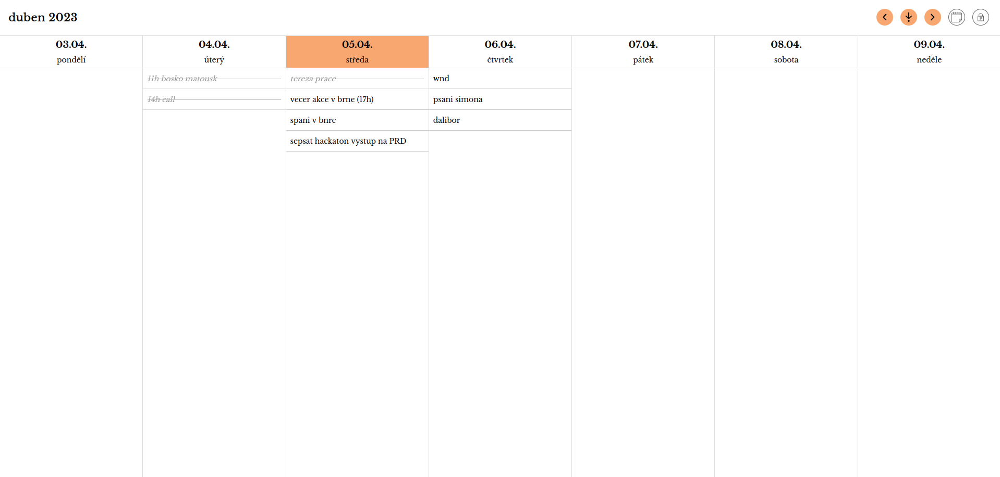
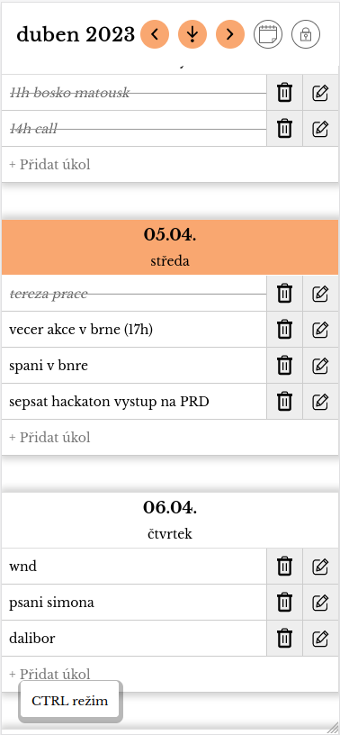

# Ordovik
Kalendář a todo-list založený na týdenním zobrazení

### Vlastnosti
 - Kliknutí či dotyk prstem na úkol jej dokončí (nebo opětovně zvýrazní)
 - Mezi týdny lze nahoře listovat šipkami
 - Také je možné rychle skočit na libovolné datum nebo zpět na dnešní den
 - se stisknutným CTRL se zobrazí operace jako přejmenování či mazání

### Instalace
Stačí aplikaci rozbalit na serveru do libovolné složky, kde běží PHP a jsou práva k zápisu.

### TODOs
 - i18n
 - přidat události, které se můžou opakovat
 - přidat barvy/štítky
 - přidat popis úkolu (třeba nákupní seznam jako detail jednoho úkolu "Nakoupit")

 ### Kontakt
 adam@rajnoha.com

 ### Self-promo
 O webařině jsem začal na youtube točit kanál. Je to především o front-endu, koukněte sem: [@adamswebsites](https://www.youtube.com/@adamswebsites).

Pokud chcete podpořit moje projekty, budu rád:

https://liberapay.com/privacydeep  
BTC: 1PM3pckn26KejhKHtpu56TyCJkL2k1zw6v  
Doge: D6w2JjEsxPc4sTbmTHa5prhEkrzQMpt7ko  